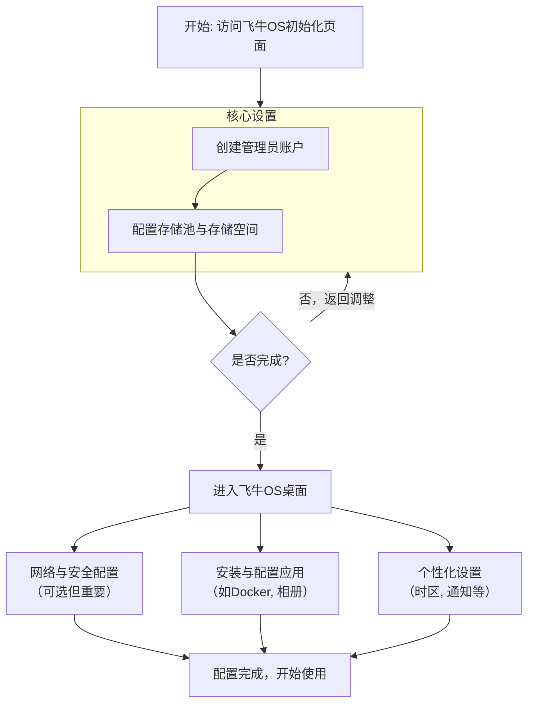

+++
date = '2025-12-07T14:57:32+08:00'
draft = false
title = '飞牛OS 初始化配置指南'
+++
飞牛OS 初始化配置指南

恭喜您完成了飞牛OS的基础安装！接下来的初始化配置是让它成为一台好用NAS的关键。下图清晰地展示了从首次登录到配置就绪的完整流程：

### 🔑 **核心步骤详解**

#### **1. 创建管理员账户**
*   **如何进入**：在浏览器中输入安装结束时记录的IP地址（如 `http://192.168.1.100:5666`），就会进入初始化向导。
*   **账户设置**：您需要创建一个**管理员账户**。请务必设置一个**强密码**并妥善保管，这是系统安全的基石。

#### **2. 配置存储池与存储空间**
这是最关键的一步，决定了数据如何存储。
*   **存储池**：可以理解为硬盘的“集合”或“组织方式”。
*   **存储空间**：是在存储池上划分出来的、用于实际存放数据的“分区”。

**对于单盘新手，建议如下操作**：
*   **模式选择**：如果您的NAS里只有一块硬盘，创建存储池时直接选择 **“Basic”（基础）** 模式即可。
*   **空间创建**：创建存储池后，系统会提示在其上创建第一个存储空间。您可以**使用全部可用容量**，或留出一部分供未来扩展。这个空间将用于存放您的文件、安装应用等。

### ⚙️ **后续重要配置（可选但推荐）**

完成核心设置进入系统桌面后，建议进行以下优化：

*   **网络与安全**：
    *   **固定IP**：在 **“控制面板” -> “网络”** 中，为您的NAS设置一个**固定的局域网IP地址**，避免IP变动导致访问失败。
    *   **远程访问**：可以尝试官方自带的“飞牛帐号”远程访问功能，或按需配置DDNS、内网穿透（如Tailscale）。
*   **系统与应用**：
    *   **应用安装**：进入 **“应用中心”** ，您可以安装“飞牛相册”、“飞牛影视”等官方应用，或启用 **“Docker”** 来运行更丰富的第三方服务。
    *   **个性化**：在 **“控制面板”** 中设置正确的时区、语言，并配置通知（如邮件）以便接收系统警报。

### 💡 **常见问题与提示**

*   **数据安全第一**：在配置存储池时，如果选择 **RAID 0** 模式，虽然能合并磁盘容量，但**一块硬盘损坏会导致全部数据丢失**，**不推荐**用于存储重要数据。重要数据务必遵循 **3-2-1备份原则**（3个副本，2种介质，1份离线）。
*   **关于跳过**：初始化向导通常无法跳过，这是确保系统安全配置的必要步骤。
*   **端口号**：飞牛OS的默认Web访问端口是 **5666**，访问地址格式为 `http://局域网IP:5666`。
*   **遇到问题**：如果初始化过程中卡住或报错，请检查网络连接，或重启NAS后重试。复杂的存储配置（如多盘RAID）建议在充分了解后再操作。

完成以上步骤，您的飞牛NAS就已经准备就绪了。如果您在配置特定功能（如Docker、远程访问）时遇到困难，随时可以继续提问。