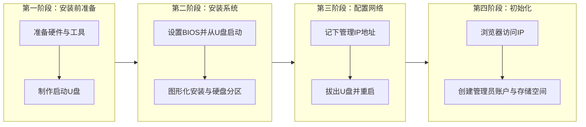

+++
date = '2025-12-07T14:51:28+08:00'
draft = false
title = '如何安装飞牛OS'
+++
根据您的需求，这里为您整理了一份详细的飞牛OS (fnOS) 安装指南。整个过程主要分为四个阶段，下图清晰地展示了从准备到完成的核心步骤。

### 📋 第一阶段：安装前准备

在开始安装前，请先准备好以下硬件和软件：

1.  **硬件与工具**：
    *   **主机设备**：一台x86架构的电脑、迷你主机或服务器。作为NAS使用，建议有**千兆或更高速度的有线网卡**。
    *   **存储硬盘**：用于安装系统的硬盘（如SSD）。安装过程会格式化此硬盘，请**务必提前备份重要数据**。
    *   **U盘**：一个容量**不小于8GB**的U盘，用于制作启动盘。
    *   **外设**：安装过程中需要连接**显示器、键盘和鼠标**。

2.  **软件下载**：
    *   **fnOS系统镜像**：从飞牛私有云官方网站下载最新的ISO镜像文件。
    *   **写盘工具**：用于将系统镜像写入U盘。常用工具有：
        *   **Rufus**：操作简单直接。
        *   **Ventoy**：可将多个ISO文件拷贝至U盘，更为灵活。

### 🛠️ 第二阶段：启动与安装系统

准备好工具后，就可以开始安装了。

1.  **制作启动U盘**：
    *   使用Rufus或Ventoy工具，将下载好的fnOS系统镜像（.iso文件）写入U盘。此操作会清空U盘数据。

2.  **设置BIOS并启动**：
    *   将启动U盘插入目标主机，开机并连续按`Del`、`F2`、`F7`或`Esc`键（具体因主板品牌而异）进入BIOS或启动菜单。
    *   **关键设置**：在BIOS的启动设置中，**务必关闭 Secure Boot（安全启动）**，否则可能导致安装失败。然后将U盘设置为第一启动项并保存重启。

3.  **开始安装fnOS系统**：
    *   主机从U盘启动后，会进入fnOS安装界面。推荐选择 **“Graphical Install”（图形化安装）** 模式。
    *   根据提示选择语言和键盘布局。
    *   在**选择安装磁盘**时请务必谨慎，**目标硬盘将被完全格式化**。
    *   设置系统分区大小，如果硬盘容量充足，建议将系统分区设置为 **64GB**。剩余空间之后可用于创建存储池。
    *   确认信息并开始安装，过程会自动进行。

### 🌐 第三阶段：配置网络与重启

1.  **配置网络并记录IP**：
    *   系统安装完成后，会自动进入网络设置界面。如果网络支持DHCP，它会自动获取IP地址。
    *   **请务必牢记此时屏幕上显示的IP地址和端口号**（例如 `192.168.1.100:5666`），这是后续通过浏览器访问管理界面的唯一地址。

2.  **重启系统**：
    *   网络设置保存成功后，按照提示**拔出U盘**，然后回车重启系统。

### 🚀 第四阶段：初始化与首次使用

系统重启后，即可开始初始化设置。

1.  **访问Web管理界面**：
    *   在局域网内的另一台电脑的浏览器中，输入刚才记录的设备IP地址（含端口），即可访问fnOS的Web管理界面。

2.  **创建管理员账户**：
    *   按照页面引导，创建第一个管理员账号（即超级管理员）。请务必设置一个高强度的密码。

3.  **创建存储空间**：
    *   登录后，系统通常会引导创建存储池和存储空间。您可以将之前安装时系统分区（如64GB）之外的空闲空间创建为存储空间，用于安装应用和存放文件。

### 💡 针对迷你主机（MiniPC）的额外提示
鉴于您之前关注硬件选择，如果您使用的是零刻等品牌的迷你主机，请注意：
*   **启动快捷键**：部分品牌迷你主机（如零刻）进入启动菜单的快捷键可能是`F7`，而非传统主板的`F12`。
*   **内置存储**：如果您的迷你主机自带eMMC存储，在安装选择磁盘时，可以将其作为系统盘使用。
*   **驱动兼容性**：绝大多数x86迷你主机的网卡、声卡等驱动在Linux内核下都能良好兼容，通常无需额外准备。

安装完成后，您就可以在应用中心探索Docker、相册、影视等丰富功能了。

希望这份指南能帮助您顺利完成飞牛OS的安装！如果在安装过程中遇到任何问题，例如在特定硬件上无法启动，或者想了解如何配置远程访问，都可以随时提问。